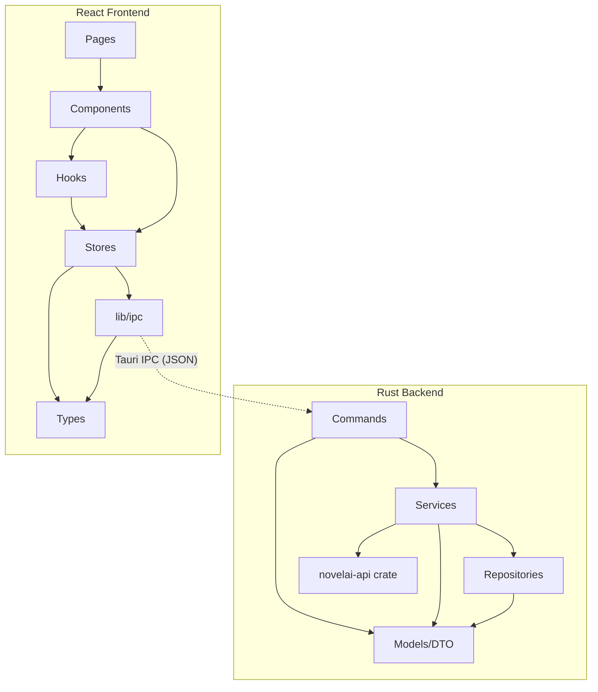
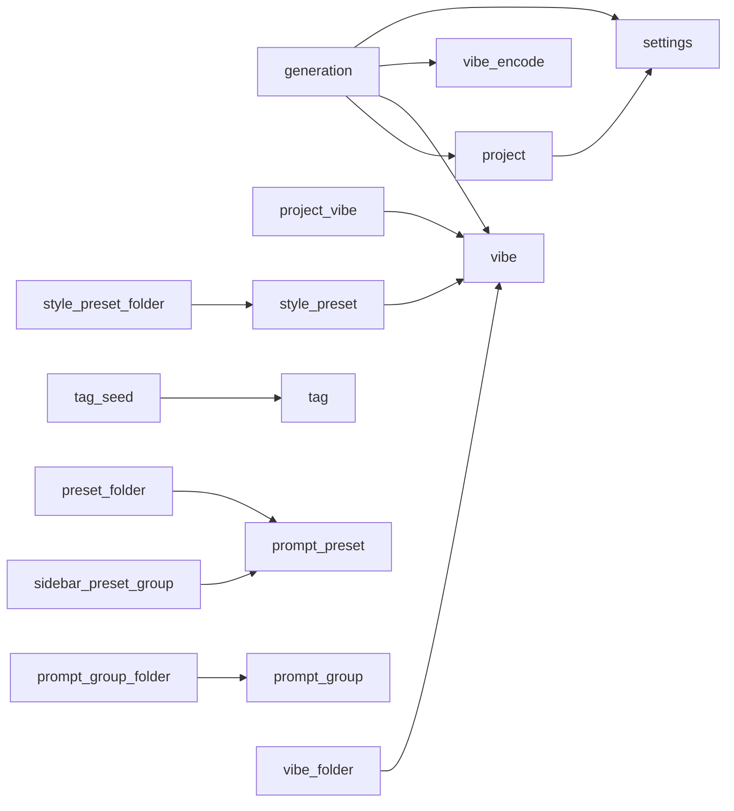
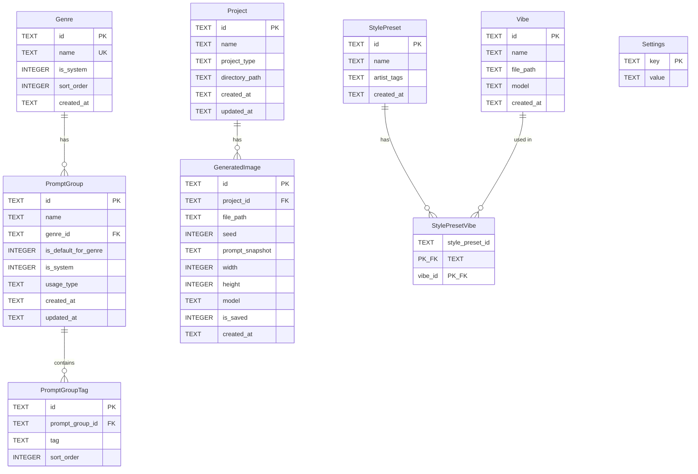

# アーキテクチャ設計

## 1. 技術スタック

| レイヤー | 技術 |
|----------|------|
| Desktop Shell | Tauri 2 |
| Backend | Rust (Tauri commands) |
| Frontend | React + TypeScript |
| UIライブラリ | Tailwind CSS + shadcn/ui |
| State管理 | Zustand |
| DB | SQLite (rusqlite, bundled) |
| API Client | `novelai-api` crate (path: `novelai_api_client/rust-api`) |
| 対応OS | macOS / Windows / Linux |

---

## 2. レイヤーアーキテクチャ

### Rust バックエンド

| レイヤー | 責務 | 依存先 |
|---------|------|--------|
| models/dto | 型定義・DTOのSerialize/Deserialize | なし |
| repositories | SQLiteデータアクセス（`&Connection`受取） | models |
| services | ビジネスロジック、オーケストレーション | models, repositories, novelai-api crate |
| commands | Tauriコマンド（thin layer: 引数パース → service呼び出し → エラー変換） | models, services |

### React フロントエンド

| レイヤー | 責務 | 依存先 |
|---------|------|--------|
| types | TypeScript型定義（Rust DTOのミラー） | なし |
| lib/ipc | typed `invoke()` wrapper | types |
| lib/constants | モデル・サンプラー・制約値 | なし |
| lib/cost | コスト計算（純粋関数） | types, constants |
| stores | Zustand stores（状態管理 + IPC呼び出し） | types, lib/ipc |
| hooks | カスタムフック（debounce, autocomplete, cost estimate） | stores, lib |
| components | UIコンポーネント | types, stores, hooks |
| pages | ページレベルレイアウト | components, stores |

### 依存方向ルール

- コードは「前方」にのみ依存できる（上の表で下→上は禁止）
- 横断的関心事はプロバイダー経由でのみアクセス



---

## 3. AppState設計

```rust
use std::sync::Mutex;
use rusqlite::Connection;
use novelai_api::client::NovelAIClient;

pub struct AppState {
    /// SQLite接続。single-writer。WAL mode有効。
    pub db: Mutex<Connection>,

    /// APIクライアント。APIキー未設定時はNone。
    /// キー変更時にSwap可能。async context で .await 越しにロック保持するため tokio::sync::Mutex を使用。
    pub api_client: tokio::sync::Mutex<Option<NovelAIClient>>,

    /// システムプロンプトDB。起動時にCSVからロード。
    /// immutableなのでMutex不要。
    pub system_tags: SystemPromptDB,

    /// アプリデータディレクトリ（`AppHandle::path().app_data_dir()` で取得）。
    /// サムネイル保存先、タグ CSV 配置など。immutable。
    pub app_data_dir: std::path::PathBuf,
}
```

| フィールド | 型 | 理由 |
|-----------|-----|------|
| db | `Mutex<Connection>` | SQLiteはsingle-writer。シングルユーザーアプリにpool不要 |
| api_client | `tokio::sync::Mutex<Option<NovelAIClient>>` | APIキー未設定時None。変更時にSwap。async context で .await 越しにロック保持が必要なため tokio::sync::Mutex |
| system_tags | `SystemPromptDB` | 起動時ロード、以後immutable。ロック不要 |
| app_data_dir | `std::path::PathBuf` | サムネイル / タグ DB 配置ディレクトリ。起動時確定、以後immutable |

---

## 4. モジュール構成

domain-model.md の境界コンテキストに準拠。モジュール数は `src-tauri/src/{commands,services,repositories}/mod.rs` を単一真実源とする（テスト専用 `*_tests.rs` は除外）。

> **更新トリガー**: `src-tauri/src/commands/mod.rs` に新モジュールを追加したら本セクションと `implementation-plan.md` の構造表も同時に更新すること。

**現在のモジュール数**: commands 17 / services 22 / repositories 17

### 4-1. コアドメイン（画像生成・プロンプト）

| モジュール | 境界コンテキスト | 責務 | 許容する依存先 |
|-----------|----------------|------|--------------|
| project | プロジェクト管理 | Project CRUD, GeneratedImage管理, 未保存クリーンアップ | settings（デフォルト取得） |
| generation | 画像生成 | パラメータ組立, API呼び出し, ファイル書込, コスト計算 | project, vibe, vibe_encode, settings |
| prompt_group | プロンプトグループ | PromptGroup/PromptGroupTag CRUD, デフォルト制御 | なし |
| genre | ジャンル管理 | Genre CRUD, Genre↔PromptGroup デフォルト紐付け | なし |
| system_prompt | システムプロンプト | CSV由来の内蔵プロンプト検索・カテゴリ管理 | なし |
| system_group_settings | システム系グループ設定 | system is_enabled 等のユーザー側上書き永続化 | なし |
| tokens | トークンカウント | CLIP トークナイザ（WASM/Rust）でプロンプト token 数算出 | なし |

### 4-2. Vibe / Style Preset

| モジュール | 責務 | 依存先 |
|-----------|------|--------|
| vibe | Vibe import/delete, サムネイル管理, `.naiv4vibe` パース | なし |
| vibe_encode | NovelAI Vibe Transfer の事前エンコード結果キャッシュ | vibe |
| project_vibe | プロジェクト ↔ Vibe 多対多, 表示/非表示切替, JOIN | vibe |
| style_preset | StylePreset CRUD（アーティストタグ + Vibe 参照束） | vibe |

### 4-3. Folder 階層管理

プロンプトグループ・Vibe・スタイルプリセット・プロンプトプリセットは、ユーザーが任意の階層フォルダで整理できる。各 Folder モジュールは `parent_id` による自己参照木テーブルを持ち、共通 CRUD パターン（`list_tree / create_node / rename / move / reorder / delete_cascade`）を実装する。

| モジュール | 対象エンティティ |
|-----------|----------------|
| prompt_group_folder | PromptGroup |
| vibe_folder | Vibe |
| style_preset_folder | StylePreset |
| preset_folder | PromptPreset |

### 4-4. Tag DB / Seed

Danbooru 由来のタグを SQLite FTS5 で全文検索し、オートコンプリート・お気に入りを提供する。

| モジュール | 責務 |
|-----------|------|
| tag | `tags` / `tags_fts` 仮想テーブル読み書き・検索 |
| tag_favorite | お気に入りタグ + グループ化（`tag_groups`, `tag_group_members`） |
| tag_seed | 起動時に CSV → DB seed（進捗通知・再 seed 制御） |
| tag_seed_csv | CSV パーサ（Danbooru 形式） |

### 4-5. Prompt Preset / Sidebar Preset Group

複数キャラクタースロットを含むプロンプトプリセットと、その組合せを「サイドバーグループ」として保存・切替する機構。

| モジュール | 責務 |
|-----------|------|
| prompt_preset | プリセット本体 + `preset_character_slots` |
| sidebar_preset_group | プリセットグループインスタンス + アクティブプリセットの多対多関連 |

### 4-6. 横断

| モジュール | 責務 |
|-----------|------|
| settings | KVS 読み書き, APIクライアント初期化, Anlas残高取得 |
| image | GeneratedImage ファイル操作（書込/削除/サムネイル） |

### モジュール間依存図



- **generation** はオーケストレーション役として複数モジュールに依存
- Folder 系 4 モジュールは対応エンティティのみに依存
- Tag DB 系（tag / tag_favorite / tag_seed）は他ドメインから独立

### 外部クレート

`novelai_api_client/rust-api`（submodule）は `novelai-api` crate として取り込み、services 層（`generation`, `vibe_encode`）からのみ呼び出す。本モジュール一覧には含めない。

---

## 5. 横断的関心事

### 5-1. エラーハンドリング

全レイヤーを貫くエラー型 `AppError` をプロバイダーとして設計。

```rust
#[derive(Debug, Error, Serialize)]
#[serde(tag = "kind", content = "message")]
pub enum AppError {
    #[error("{0}")]
    NotFound(String),
    #[error("{0}")]
    Validation(String),
    #[error("{0}")]
    Database(String),
    #[error("{0}")]
    ApiClient(String),
    #[error("{0}")]
    Io(String),
    #[error("{0}")]
    NotInitialized(String),
}
```

- `thiserror` で `Display/Error` 自動実装
- `serde::Serialize` + `#[serde(tag = "kind")]` でフロントエンドがkindでマッチ可能
- `From` 実装: `rusqlite::Error` → `Database`, `NovelAIError` → `ApiClient`, `io::Error` → `Io`
- `InsufficientAnlas` は `ApiClient` に含め、メッセージから判別

**フロントエンド側:**

```typescript
interface AppError {
  kind: 'NotFound' | 'Validation' | 'Database' | 'ApiClient' | 'Io' | 'NotInitialized';
  message: string;
}
```

各Store actionでtry/catch → `toastError(String(e))` で通知。`NotInitialized` は設定ダイアログ誘導。

**`toastError()` ヘルパー** (`src/lib/toast-error.ts`):

- `toast.error()` を Sonner の `action` オプション付きでラップ
- アクションボタン: Copy アイコン（lucide-react）— クリックでメッセージをクリップボードへコピー → `toast.success(copied)` を表示
- 全モーダル・ページで `toast.error()` の直接呼び出しを禁止し、このヘルパーを使用

**インラインエラー表示**（例: `ImageDisplay.tsx`）:

- `useState` + `navigator.clipboard.writeText()` で Copy/Check アイコンボタンを実装
- コピー後2秒間 Check アイコンを表示してフィードバック

### 5-2. ロギング

- Rust側: `tracing` crate（Tauri 2のlog pluginと連携）
- 構造化ログ: `tracing::info!(project_id = %id, "project opened")`
- フロントエンド側: `console.log/warn/error`（デスクトップアプリのためシンプルに）

### 5-3. 認証

- NovelAI APIキーのみ（ユーザー認証なし：シングルユーザーデスクトップアプリ）
- APIキーは `secrecy::SecretString` でメモリ上に保持
- DB保存は `settings` テーブルのKVS（暗号化はSECURITY.mdで検討）

---

## 6. データベース設計

### ER図



### マイグレーション方針

- `migrations/001_init.sql` にフルスキーマ定義（domain-model.mdの `## 3. SQLiteスキーマ定義` をそのまま使用）
- `include_str!("../migrations/001_init.sql")` でバイナリに埋め込み
- アプリ起動時に `db.rs` で実行
- 将来のスキーマ変更は `002_xxx.sql`, `003_xxx.sql` と番号付きで追加
- `settings` テーブルに `schema_version` キーで現在のバージョンを管理

---

## 7. データフロー

### 画像生成フロー（E2E）

```
[Frontend]                           [Tauri Backend]                    [novelai-api crate]
    │                                     │                                  │
    │ generation-store.generate()          │                                  │
    │  → isGenerating = true              │                                  │
    │  → GenerateRequestDto組立           │                                  │
    │                                     │                                  │
    │ ipc.generateImage(dto)              │                                  │
    │ ─────── invoke('generate_image') ──>│                                  │
    │                                     │ commands::generate_image()        │
    │                                     │  → services::generation::generate()
    │                                     │     1. api_client取得 (Mutex lock)│
    │                                     │     2. Vibe読込 (DB → ファイル)   │
    │                                     │     3. GenerateParams構築         │
    │                                     │        (Builder pattern)          │
    │                                     │     4. client.generate()          │
    │                                     │ ──────────────────────────────────>│
    │                                     │                                  │ HTTP POST
    │                                     │                                  │ (ZIP/msgpack)
    │                                     │     GenerateResult               │
    │                                     │ <──────────────────────────────────│
    │                                     │     5. ファイル書込               │
    │                                     │        {project}/images/{ts}_{seed}.png
    │                                     │     6. prompt_snapshot JSON構築   │
    │                                     │     7. DB INSERT (is_saved=0)     │
    │                                     │                                  │
    │  GenerateResultDto                  │                                  │
    │  { id, base64_image, seed,          │                                  │
    │    file_path, anlas_remaining }      │                                  │
    │ <───────────────────────────────────│                                  │
    │                                     │                                  │
    │ → isGenerating = false              │                                  │
    │ → history-store.addImage(result)    │                                  │
    │ → settings-store.refreshAnlas()     │                                  │
    │ → UI更新 (ImageViewer + History)    │                                  │
```

### プロンプト組み立てフロー

```
メインプロンプト入力 (freeText)
  + プロンプトグループ選択 → assembleFullPrompt() → タグ結合
  = base_caption
  ネガティブ: negativeOverride ?? assembleNegativeFromGroups(groups)

キャラクター × N
  各キャラクター:
    プロンプト入力 + グループタグ結合 = char_caption
    ネガティブ: negativeOverride ?? assembleNegativeFromGroups(groups)
    center_x, center_y = 位置座標

アーティストタグ（sidebarArtistTags + 有効プリセット、この順で結合）→ base_captionに追記

  ↓ v4_prompt JSON構造に変換

v4_prompt: {
  caption: {
    base_caption: "...",
    char_captions: [{ char_caption: "...", centers: [{x, y}] }, ...]
  }
}
```

**ネガティブプロンプト優先順位**:
1. `negativeOverride` が非 `null` → その値をそのまま使用（手動入力 or 旧データ移行値）
2. `negativeOverride === null` → `assembleNegativeFromGroups(groups)` の結果を使用（タグの `negativePrompt` フィールドを収集）

---

## 8. 変更履歴

| 日付 | 内容 |
|------|------|
| 2026-04-07 | 初版作成 |
| 2026-04-16 | PR-E: ネガティブプロンプト組み立てフロー更新 (negativeOverride + assembleNegativeFromGroups) |
| 2026-04-16 | feat/sidebar-direct-artist-tags: サイドバー直接アーティストタグ入力を追加 (useSidebarArtistTagsStore, useArtistTagInput hook) |
| 2026-04-17 | doc-refresh: セクション4 モジュール構成を正準化（17/22/17）、Folder 階層管理・Tag DB・Prompt Preset 節を追加。AppState に `app_data_dir` を明記。 |
